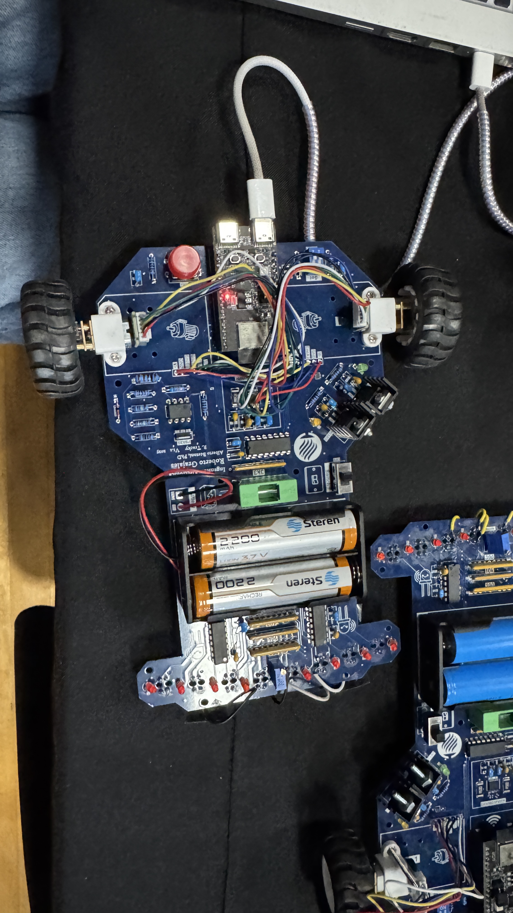

# Line Follower with Adaptive PID Control

This project implements a **line follower robot** using PID (more like PD) control and IR sensor readings through a multiplexer.  
The code is written in **C++ for Arduino** and dynamically adjusts its parameters based on the line’s position (name of the file: line.cpp).

---

## Features

- Adaptive PID control depending on the type of curve or line loss.  
- IR sensor reading via multiplexer (fewer pins required).  
- Automatic stop when black is detected for more than 0.3 seconds.  
- Smooth speed correction between motors.  
- Central sensor prioritization to maintain straight paths.  

---

## How It Works

1. The IR sensors read the line and send values (0 or 1) to the microcontroller.  
2. A weighted average error is calculated based on the active sensors.  
3. The PID controller generates a correction signal that adjusts each motor’s speed.  
4. If all sensors detect black for more than 0.3 s, the robot stops.  

---

## Main Connections

| Component | Pins |
|------------|------|
| Motors A/B | 18, 19, 20, 21 |
| Encoders | 2, 3, 22, 23 |
| Multiplexer | S0: 4, S1: 5, S2: 0, Y: 1 |
| Start/Stop Button | 14 |

---

## PID (Base Values)

| Parameter | Value |
|------------|--------|
| Kp | 9.9 |
| Ki | 0.00000115 |
| Kd | 1.5 |

These values work well as a starting point but can be fine-tuned depending on the track or motor response.

---

## Usage

1. Upload the code to the Arduino.  
2. Place the robot on the track.  
3. Press the start button.  
4. The robot will automatically follow the line.  
5. If it detects a black area for more than 0.3 s, it stops.  

---

## MATERIALS 

- Arduino (UNO, MEGA, or similar)  
- 8 IR sensors  
- Multiplexer (CD4051 or similar)  
- Motor driver (L298N or L293D)  
- 2 DC motors with encoders  
- Stable power supply  

---
## Notes

The PCB used in this project was designed by **Tecnológico de Monterrey**,  
but the system can be easily adapted to custom boards or different hardware setups.

---
## Image

---
## See more 

See more of the hardware, build, schematic, simulation, etc. on the official Repo https://github.com/IRS-tecMty/tir-lineFollower

---

